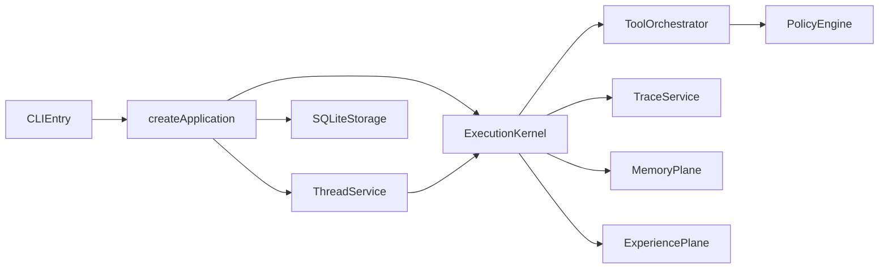

# Architecture

Core data path:

1. CLI parses command and resolves app config.
2. Kernel creates task/run metadata.
3. Provider loop executes with policy + tool orchestration.
4. Trace/audit/memory/experience are persisted in SQLite.
5. Threads own cross-run continuity; each task run is linked into thread lineage.
